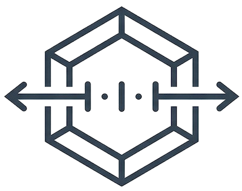
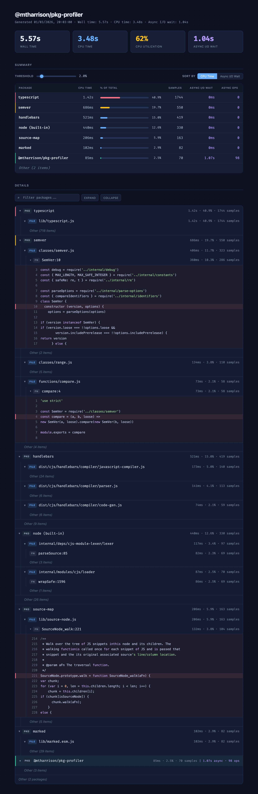

<p align="center">
  
</p>

<h1 align="center">@mtharrison/pkg-profiler</h1>

<p align="center">
  <strong>Where's your wall time going? Find out in one call.</strong><br>
  Zero-dependency sampling profiler that breaks down Node.js wall time by npm package.
</p>

<p align="center">
  <a href="https://www.npmjs.com/package/@mtharrison/pkg-profiler"></a>
  
  <a href="LICENSE"></a>
</p>

<p align="center">
  
</p>

## Quick Start

```typescript
import { start, stop } from "@mtharrison/pkg-profiler";

await start();
// ... your code here ...
const result = await stop();
result.writeHtml(); // writes an HTML report to cwd
```

Or use the convenience wrapper:

```typescript
import { profile } from "@mtharrison/pkg-profiler";

const result = await profile(async () => {
  await build();
});
result.writeHtml();
```

## What You Get

A self-contained HTML report that shows exactly which npm packages are eating your wall time. The summary table gives you the top-level picture; expand the tree to drill into individual files and functions. First-party code is highlighted so you can instantly see whether the bottleneck is yours or a dependency's.

## API

### `start(options?)`

Start the V8 CPU sampling profiler. Safe no-op if already profiling.

| Option     | Type     | Default    | Description                       |
| ---------- | -------- | ---------- | --------------------------------- |
| `interval` | `number` | V8 default | Sampling interval in microseconds |

### `stop()`

Stop the profiler and return a `PkgProfile` containing the aggregated data. Resets the sample store afterward.

### `clear()`

Stop profiling and discard all data without generating a profile.

### `profile(fn)`

Profile a block of code. Starts the profiler, runs `fn`, stops the profiler, and returns a `PkgProfile`.

```typescript
const result = await profile(async () => {
  await runBuild();
  await runTests();
});
const path = result.writeHtml();
```

### `profile({ onExit })`

Long-running mode for servers. Starts the profiler and registers shutdown handlers for SIGINT, SIGTERM, and `beforeExit`. When triggered, stops the profiler and calls `onExit` with the result.

```typescript
await profile({ onExit: (result) => result.writeHtml() });

const app = createApp();
app.listen(3000);
// Ctrl+C → stop() called → onExit fires → writeHtml() → process exits
```

### `PkgProfile`

Returned by `stop()` and `profile()`. Contains aggregated profiling data.

| Property      | Type             | Description                                  |
| ------------- | ---------------- | -------------------------------------------- |
| `timestamp`   | `string`         | When the profile was captured                |
| `totalTimeUs` | `number`         | Total sampled wall time in microseconds      |
| `packages`    | `PackageEntry[]` | Package breakdown sorted by time descending  |
| `otherCount`  | `number`         | Number of packages below reporting threshold |
| `projectName` | `string`         | Project name from package.json               |

#### `writeHtml(path?)`

Write a self-contained HTML report to disk. Returns the absolute path to the written file.

- **Default**: writes to `./where-you-at-{timestamp}.html` in the current directory
- **With path**: writes to the specified location

## How It Works

Uses the V8 CPU profiler (`node:inspector`) to sample the call stack at regular intervals. Each sample's leaf frame is attributed the elapsed wall time, then file paths are resolved to npm packages by walking up through `node_modules`. No code instrumentation required.

## Requirements

Node.js >= 20.0.0

## License

MIT
